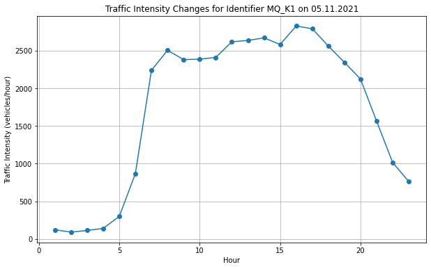
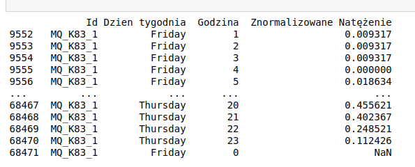
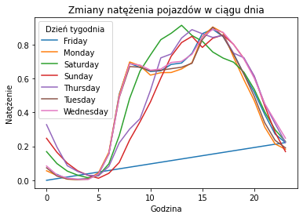

# Traffic and Travel Calculator


## Installation


1. Install dependencies:

    ```bash
    pip install -r requirements.txt
    ```

## Usage

1. Run the Flask application:

    ```bash
    python app.py
    ```

2. Access the following endpoints:

    - **Get Traffic Data**: 
        - Endpoint: `http://localhost:5000/get_traffic`
        - Method: `GET`
        - Parameters:
            - `hour` (integer): The hour for which traffic data is requested.
            - `day_of_week` (string): The day of the week for which traffic data is requested.
        - Response: JSON with traffic data.

    - **Get Current Traffic Data**: 
        - Endpoint: `http://localhost:5000/get_current_traffic`
        - Method: `GET`
        - Response: JSON with current traffic data.

    - **Get Saving for Travel**: 
        - Endpoint: `http://localhost:5000/get_saving_for_travel`
        - Method: `GET`
        - Parameters:
            - `transport_type` (integer): Identifier for the means of transport.
            - `distance` (float): The distance of the travel.
            - `avg_consumption` (float, optional): Average fuel consumption in liters per 100 km for a car.
            - `fuel_type` (integer, optional): Fuel type (0 for gasoline, 1 for diesel) for a car.
            - `fuel_price` (float, optional): Fuel price per liter for a car.
        - Response: JSON with cost and CO2 emission savings.

    - **Get Annual Saving Summary**: 
        - Endpoint: `http://localhost:5000/get_annual_saving`
        - Method: `GET`
        - Parameters:
            - `avg_consumption` (float, optional): Average fuel consumption in liters per 100 km for a car.
            - `fuel_type` (integer, optional): Fuel type (0 for gasoline, 1 for diesel) for a car.
            - `daily_distance` (float, optional): The daily distance traveled for a car.
        - Response: JSON with annual cost and CO2 emission savings.


## How it works

1. Cost and CO2 emission calculator


- Travel cost and CO2 emission savings.

To calculate saving for specific travel we first calculate emission and cost for selected means of transport (walking, scooter or bus)
Then we calculate cost and emission for car based on engine type, average fuel consumption and fuel price. 
Average CO2 emission per 100 km for combustion engines vehicles was taken as average split between gasoline and diesel engine.

Then we subtract cost for car and selected means of transport to calculate total savings

- Annual savings

We provide function to calculate total annual saving (cost and CO2 emission) selecting alternative means of transport

Based on daily average distance covered bu user we calculate total annual cost (fuel) and CO2 emission.


2. Current traffic volume

Based on measured data traffic flow in Rzeszów from OpenData we extract information on traffic volume for specific weekday and hour.
We use current traffic volume to estimate scoring rate

- Data processing

You can follow the process with saved jupyter notebook checkpoints:

    
    jupyter notebook traffic_intensity/data_parser.ipynb
    


First we analyse how it looks for selected street




Then we normalize data from 0 to 1 for selected street




Then we calculate average traffic volume for every weekday and hour




Data were saved in csv: 

    traffic_intensity/data/global_avarage_traffic.csv


- Get current traffic

We provide function to calculate current traffic (value from 0 to 1) based on specific hour and weekday.
This normalized traffic volume is used as score ratio. 
